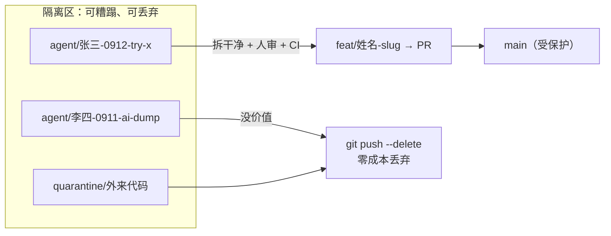

# a17-industry-research-agent 团队协作与文档规范

> 版本 v1.2 · 更新日期 2026-09-11 · 生效日期 2026-09-09 · 适用仓库 `ABSkknnkl/a17-industry-research-agent`
> v1.1 新增：§6.5 隔离分支（无存活时间限制）
> v1.2 调整为**宽松协作**：姓名名单 / 大文件 / 分支保护 / PR 行数 / 变更文档 / AI 通读 等改为**提醒或可选**，不硬拦
> 团队规模：**4 名开发者**
> 本文件以**协作建议**为主；机器只硬拦垃圾提交信息与测试产物入库。

---

## 0. 团队名单与模块分工（请先填实）

| 成员 | git `user.name` 必须填 | 主责模块 | CODEOWNERS 兜底 |
| --- | --- | --- | --- |
| 成员 A | `张三` | `backend/app/agents/data_fetcher/` | 是 |
| 成员 B | `李四` | `backend/app/agents/chart_generator/`、`frontend/` | 是 |
| 成员 C | `王五` | `backend/app/agents/chapter_writer/`、`contracts/` | 是 |
| 成员 D | `赵六` | `eval/`、`backend/tests/` | 是 |

> **上线前必做**：把这张表填成真名，同步更新 `CODEOWNERS` 和 `.githooks/team.txt`。
> 提交信息里的姓名必须 **与 `team.txt` 完全一致**，否则 commit 会被钩子拒绝。

全员一次性配置（各自本机执行）：

```bash
git config user.name "张三"                       # 必须是真名，禁止 nick / 邮箱前缀
git config user.email "zhangsan@公司域名.com"      # 必须能收到 GitHub 通知
bash scripts/install-hooks.sh                     # 装钩子（见第 5.3 节）
```

---

## 1. 提交规范：每条提交必须能追溯到人

### 1.1 格式

```
<type>(<scope>): <姓名> <subject>

<body>

<footer>
```

**示例**

```
fix(backend): 张三 修复 evidence_items 空列表导致 A2 覆盖循环崩溃

当 revision 为空列表时，原实现跳过循环体直接进入赋值分支，
导致 DataInterpretReviewEdits.evidence_items 被置空。
增加空列表特判与兜底防线，补充回归测试与契约白名单。

变更文档：docs/changes/2026-09-09-张三-fix-evidence-empty-list.md
Refs #17
```

### 1.2 type 白名单

`feat` `fix` `refactor` `perf` `test` `docs` `build` `ci` `chore` `revert`

### 1.3 scope 建议

`backend` `frontend` `contracts` `eval` `docs` `agent1`…`agent5` `linter` `charts` `deps`

### 1.4 关于姓名位置的说明

推荐 `type(scope): 张三 描述`，原因：**type 在前机器可解析**（commitlint、自动生成 changelog 依赖它），姓名紧随其后在 `git log` 里一眼可见，同样满足追溯需求。

如果团队更习惯「张三：修复 xxx」这种姓名开头，把格式改成：

```
<姓名>：<type>(<scope>) <subject>
```

对应把 `commitlint.config.js` 里的 `AUTHOR_FIRST` 设为 `true`（已预留开关）。

### 1.5 建议与仅有的硬拦

| 项 | 级别 |
| --- | --- |
| 姓名在 `team.txt` | **提醒**，不强制 |
| 格式 `type(scope): 姓名 描述` | **建议**，不强制 |
| 纯数字 / AI prompt 原文 | **硬拦**（不可检索） |
| `pre-termination backup` | 提醒 |

### 1.6 AI Agent 提交的署名

AI 工具的提交可挂在使用者名下，也可带 `Co-authored-by`。建议 headline 写人名，**不强制**。

---

## 2. 上传范围：只进源码和重要文档

### 2.1 必须进版本库

| 类别 | 示例 |
| --- | --- |
| 功能源码 | `backend/**/*.py`、`frontend/src/**` |
| 数据契约 | `contracts/*.schema.json`、前端 TS 类型 |
| 测试**源码** | `backend/tests/**`、前端 `*.spec.ts` |
| 构建配置 | `pyproject.toml`、`package.json`、`vite.config.ts`、锁文件 |
| 重要文档 | 需求说明、接口文档、架构决策、`README.md`（`docs/changes/` 建议写） |
| 团队约定 | 本文件、`AGENTS.md`、`CODEOWNERS`、`.githooks/` |

### 2.2 一律不进版本库

| 类别 | 具体 |
| --- | --- |
| 测试**产物** | `logs/`、`*.log`、`.pytest_tmp/`、`coverage/`、`htmlcov/` |
| 构建输出 | `dist/`、`build/`、`*.egg-info/`、`frontend/dist/` |
| 截图 / 临时报告 | `screenshots/`、评测跑出来的 `*.pdf`、`artifacts/`、`/output/` |
| 运行时状态 | `data/checkpoints.sqlite`、`*.pid`、`*.pids` |
| 大数据/中间结果 | `eval/transcript/**` 的跑测输出、`*.jsonl` 遥测 |
| 临时压缩包 | `.trae-html-share-packages/`、`*.html.zip` |

> **硬拦**：上表测试产物 / 缓存 / 敏感文件。
> **不硬拦**：单文件 > 500KB（只提醒）、变更文档缺失（只提醒）。
> 判据：人写的进，跑出来的不进。

### 2.3 提交前自检

```bash
git status -s
git add <具体文件>      # 建议，避免 git add .
git commit             # 不带 -m 用模板更方便
```

> `.gitignore` 只管**未跟踪**的文件。已经进版本的必须先 `git rm --cached <路径>`（我们已做过一次 317 文件的清理）。

---

## 3. 忽略规则：AI 记忆排除，重要文档保留

### 3.1 必须排除（AI 辅助开发产生的本地记忆 / 上下文）

```
.workbuddy/            # WorkBuddy 记忆与会话状态
.workbuddy-ai/
.trae/                 # Trae 上下文
.trae-html-share-packages/
.claude/               # Claude Code 本地状态（settings.local.json 等）
.cursor/
.aider*
session-log.md         # AI 会话日志
*-session-log.md
docs/session-logs/
```

**例外白名单**（这些要进版本库）：

```
!AGENTS.md             # 团队给 AI 的统一指令，是全队共识
!CLAUDE.md             # 同上
!.claude/commands/     # 团队共享的自定义命令
```

### 3.2 必须纳入版本管理的重要文档

| 文档 | 位置 | 谁维护 |
| --- | --- | --- |
| 需求说明 | `docs/requirements/` | 需求提出人 |
| 接口文档 | `docs/api/` | 接口改动者 |
| 架构决策（ADR） | `docs/adr/` | 提案人 |
| **最终变更文档** | `docs/changes/` | **每次改代码的人**（见第 4 节） |
| 本周汇总 | `CHANGELOG.md` | 每周轮值 |

### 3.3 排错命令

```bash
git check-ignore -v <路径>     # 查某文件为什么被/不被忽略
git status --ignored -s        # 看当前忽略了哪些
git ls-files | wc -l           # 跟踪文件总数（异常增长说明漏配规则）
```

---

## 4. 最终变更文档（建议，不强制）

### 4.1 规则

- **建议**每个 PR 一份变更文档，路径 `docs/changes/YYYY-MM-DD-<姓名>-<slug>.md`
- 小改动可省略；复杂/跨模块改动建议写清：**改了什么、影响范围、怎么验证**
- CI 只对缺失变更文档发 **warning**，不 fail

### 4.2 模板（见 `docs/changes/TEMPLATE.md`）

```markdown
# 变更：<一句话概括>

- 日期：2026-09-09
- 作者：张三
- 关联 PR：#18
- 类型：功能 / 修复 / 重构 / 文档

## 改了什么
## 为什么改
## 影响范围
## 验证方式
## 回滚方案
## 遗留与风险
```

### 4.3 怎么执行

- PR 模板里有勾选项，**建议**填，不填不阻塞
- CI 的 Change Doc job **只 warning**
- 评审时可口头提醒，**不强制打回**

---

## 5. 落地机制（怎么保证上面四条被执行）

### 5.1 `.gitignore`

仓库根目录 `.gitignore` 已按第 2、3 节配置。追加规则见交付的 `gitignore-additions.txt`。

### 5.2 提交模板

```bash
git config commit.template .gitmessage     # 或 git config --global
```

之后 `git commit`（不带 `-m`）自动打开模板，含格式说明和姓名提示。

### 5.3 Git 钩子（本地第一道闸）

```bash
bash scripts/install-hooks.sh     # 会设置 core.hooksPath .githooks 并给可执行权限
```

| 钩子 | 拦什么 |
| --- | --- |
| `pre-commit` | ① 禁止目录/后缀（`logs/` `.pytest_tmp/` `.workbuddy/` `*.html.zip` …）② 单文件 > 500KB ③ 禁止 `.env` 类敏感文件 ④ 提醒未写变更文档。**对隔离分支同样生效**（§6.5.5） |
| `commit-msg` | ① 格式必须是 `type(scope): 姓名 描述` ② 姓名必须在 `.githooks/team.txt` ③ 拦截纯数字 / AI prompt / `wip` / `pre-termination backup` |

钩子是**本地**的，可被 `--no-verify` 绕过。所以还需要服务端兜底：

### 5.4 commitlint（服务端第二道闸）

`commitlint.config.js` 里加了 `require-author` 规则，在 CI 中对 PR 的全部提交逐条校验，绕过本地钩子的提交在这里被拦下。

### 5.5 分支保护（可选，默认关闭）

```bash
# 默认不强制；需要时手动打开（脚本会先问 yes/NO）
bash scripts/setup-branch-protection.sh
```

| 项 | 宽松默认 | 说明 |
| --- | --- | --- |
| 禁止直接 push main | **不强制**（约定提醒） | 可直接 push，靠团队自觉 |
| 必须 PR | **不强制** | 建议走 PR |
| approve 数 | 可选 ≥1 | 脚本打开时用 1 |
| force push | 脚本宽松版**允许** | 按你们要求不强制禁止 |
| CI 必绿 | 建议 | 保护打开时才会强制 |

> **当前策略：不跑脚本 = 无 GitHub 分支保护，规则只作约定。**

### 5.6 三层防护总览（实际生效的）

```
写代码 → git add  → pre-commit（拦测试产物/敏感文件；大文件/变更文档只提醒）
       → git commit → commit-msg（拦纯数字/AI prompt；格式/名单只提醒）
       → git push  → CI（后端/前端测试硬过；commitlint 垃圾信息硬拦
                          变更文档/PR 行数只 warning）
       → 开 PR     → 人审（建议，不强制）
       → merge     → squash（若走 PR）
```

---

## 6. 分支管理（4 人版）

### 6.1 分支模型：Trunk-Based + 短命分支

```
main                          ← 唯一长期分支，永远可运行，受保护
 ├── feat/张三-chart-gallery   ← 已明确意图的开发分支，尽量短命
 ├── fix/李四-evidence-empty   ← 修复分支，尽量短命
 ├── docs/王五-api-contract    ← 文档分支，尽量短命
 └── agent/…                  ← 隔离分支，见 §6.5（无时间限制、可丢弃、禁止直接进 main）
```

两类分支的边界：

| | 开发分支 `feat/fix/docs/…` | 隔离分支 `agent/…` / `quarantine/…` |
| --- | --- | --- |
| 入口条件 | 你知道要做什么、改动可描述 | 未验证、AI 批量产出、试错、外部拷贝 |
| 是否必须开 PR | 是 | 否（可整支丢弃） |
| 能否进 main | 只能通过 PR + 门禁 | **只能通过从隔离分支拆出的干净 PR** |
| 合并方式 | Squash into main | **禁止整支 merge / 禁止直接 squash 进 main** |
| 生命周期 | 尽量短，合并后 24h 内删除 | **无时间限制**，直到选择结局（进 main / 丢弃） |

**为什么不用 Git Flow**：4 人 + MVP 阶段 + 无并行版本维护，develop/release/hotfix 三套长期分支只会制造合并地狱。我们之前 3 条分支 36 天零同步、PR 冲突的教训是「长期共用、无门禁」，不是「活得久」——所以隔离分支可以长期存在，但**禁止共用、禁止直接进 main**。

### 6.2 分支命名（强制带姓名）

```
<type>/<姓名>-<简短slug>
```

带姓名的作用：一眼看出这是谁的分支，谁该去 rebase，谁该去删。

### 6.3 硬规则

| 规则 | 约束 |
| --- | --- |
| R1 | 开发分支尽量短命；超过 3 天未 PR 群内说一声即可 |
| R2 | 单个 PR 变更 **不强制** ≤ 400 行（只提醒） |
| R3 | 合并前建议 rebase；**禁止**把隔离分支整支 merge 进 main |
| R4 | 合并后建议删除开发分支 |
| R5 | **不强制**禁止直接 push main / force push（约定优先，保护可选） |
| R6 | 每人同时进行的开发分支建议 ≤ 2 个 |
| R7 | 未验证 / AI 产出 / 外来代码走隔离分支（`agent/*`、`quarantine/*`），见 §6.5 |
| R8 | 隔离分支**无存活时间限制**，但禁止共用、禁止整支 merge 进 main |

### 6.4 合并方式：Squash and Merge

特性分支上可以有 10 个「修一下」「再改改」的提交，squash 之后 main 上只留 1 个干净提交。
**这一条对 AI 辅助开发尤其重要**——AI 在分支上制造 20 个垃圾提交无所谓，主干历史依然可读。

### 6.5 隔离分支：未验证代码的统一入口

> **动机**：不让人（或 AI）把「我不知道这能不能跑」的代码直接糊进 `main`。
> 但也**绝不允许**出现一个多人共用、往上堆的「公共 agent 分支」——那正是本仓库
> 历史上 `trae/agent-*` 36 天零同步、PR #1 膨胀到 1663 文件的根因。
> **注意：问题是「共用 + 无门禁 + 整支 merge」，不是「分支活得久」。**
> 所以隔离分支**没有存活时间限制**，想留多久留多久。

#### 6.5.1 什么时候必须走隔离分支

| 场景 | 例子 |
| --- | --- |
| AI 会话一次性产出，未人工通读 | Trae / Claude / Cursor 批量生成的改动 |
| 外部拷贝 / 粘贴进来的代码 | 从示例仓库、文档、其他项目拷的模块 |
| 试验性重构或依赖升级 | 换 ORM、换图表库、试新框架版本 |
| 不确定能不能跑的本地半成品 | 自己写的脚本、半截实验、调试用代码 |
| 评审方案「先落盘再慢慢验」 | 比如本次要落地的 hooks / CI / 约定文件 |

**不要**为「已经想清楚、描述得出来的功能」开隔离分支——直接用 `feat/` `fix/`。

#### 6.5.2 命名与生命周期

```
agent/<姓名>-<日期或意图>
```

示例：

```
agent/张三-0912-linter-r11
agent/李四-0911-ai-chart-dump
agent/赵六-0913-dep-upgrade-try
quarantine/王五-0911-external-skill-kludge   # quarantine 与 agent 同规，语义更重：外来不明代码
```

硬规则：

| 规则 | 约束 |
| --- | --- |
| I1 | **禁止共用**。一人一事一分支；可以长期保留，但只能属于一个人/一件事 |
| I2 | **无存活时间限制**。想留多久留多久，直到选择结局（见 6.5.3） |
| I3 | 隔离分支上**可以** force push、可以 `reset --hard`、可以整支删除 |
| I4 | 隔离分支**不受** CODEOWNERS 必审约束（它们本来就不该被 review） |
| I5 | 隔离分支**同样受** `.githooks` 约束：提交信息、禁止垃圾文件 —— 未验证 ≠ 可以塞 20MB sqlite |
| I6 | 单人同时存活的隔离分支 ≤ **5** 个（防止堆积失控，不是时间限制） |

#### 6.5.3 三种结局（必须选一个）

```
隔离分支 agent/…
   ├─ ① 有价值 → 从它拆出干净分支 → 开 PR → 门禁 → squash 进 main → 删隔离分支
   ├─ ② 没价值 → git push origin --delete agent/…  （零成本丢弃）
   └─ ③ 还要继续做 → 继续推，分支可以一直活着，无时间压力
```

**禁止**的第四种：「多人把代码都堆在同一个 agent 分支上，最后一把 merge 进 main」。
那不是隔离，是把污染延迟到更难处理的时候。

> 为什么取消时间限制：硬性「3 天必须清」在真实开发里很难执行，反而逼人糊弄。
> 本仓库真正的历史教训是**共用分支 + 无门禁 + 整支 merge**，不是「分支活得久」。
> 所以隔离分支允许长期存在，靠「不共用、不整支进 main、受 hooks 约束」三条守住底线。

#### 6.5.4 怎么从隔离分支进 main（唯一合法路径）

```bash
# 假设隔离分支是 agent/张三-0912-linter-r11，其中只有部分改动可用
git switch -c feat/张三-linter-r11 origin/main

# 逐文件/逐提交挑选，禁止 git merge agent/…
git checkout agent/张三-0912-linter-r11 -- path/to/one/file.py
# 或
git cherry-pick <sha>

# 自检：卫生、测试、变更文档
./scripts/verify.sh
# 写 docs/changes/YYYY-MM-DD-张三-linter-r11.md

git add <具体文件>
git commit      # 信息里必须写清「本人已通读/验证」
git push -u origin feat/张三-linter-r11
gh pr create    # 走正常 PR + CI + review
```

PR 描述里若改动来自隔离分支 / AI，必须写明：

```markdown
## 来源
- 自隔离分支：agent/张三-0912-linter-r11
- 是否含 AI 生成：是/否
- 人工验证：已本地跑通 X / 尚未跑（未跑通不得勾 ready）
```

#### 6.5.5 隔离分支上的卫生底线（和 main 同一套）

隔离分支**允许**提交信息随意、允许反复 force、允许脏历史，但**不允许**：

| 禁止 | 原因 |
| --- | --- |
| `.pytest_tmp/`、`logs/`、`dist/`、`*.sqlite` | 钩子直接拒绝；进历史后清理成本远高于现在拦住 |
| `.workbuddy/`、`.trae/`、`.claude/` 本地状态 | AI 记忆，不是产品代码 |
| 密钥 / `.env` | 安全红线，任何分支都不行 |
| 单次 `git add .` 塞进上百个无关文件 | 之后根本没法 cherry-pick，隔离就白隔离了 |

> 原则：**隔离的是「正确性」，不是「纪律」。**
> 脏历史可以，脏文件不行。

#### 6.5.6 与 `sandbox` 的区别（可选，4 人阶段先不用）

若将来确实需要多人联调一个不稳定的实验，可开长期 `sandbox/<主题>` 分支，但：

- **禁止**任何人直接 merge `sandbox/*` 进 main
- 只能从 sandbox **cherry-pick** 到新的干净分支再 PR
- 每周轮值可 `git push origin --delete sandbox/*` 或 `reset --hard origin/main` 清空重来

4 人 MVP 阶段：**用 `agent/*` 就够了，不要提前引入 sandbox。**

#### 6.5.7 一张图看懂



---

## 7. 代码评审

### 7.1 基本要求

| 项 | 要求 |
| --- | --- |
| 审批数 | **不强制**；建议 1 个 approve（保护打开时才有） |
| 自审 | 建议作者不 approve 自己 |
| 首次响应 | 尽快，无硬性 SLA |
| PR 规模 | **不强制**行数上限 |
| 合并人 | 建议由 reviewer 合并 |

### 7.2 Reviewer 建议看

1. 有没有把测试产物 / AI 记忆文件带进来
2. 数据契约改动是否同步
3. 变更文档（若写了）是否准确
4. 影响范围

> **不要求**「AI 生成代码必须人工逐行读懂」——建议尽量通读，不强制。

### 7.3 评审意见分级

- 🔴 **建议改**：逻辑错误、混入垃圾文件、破坏契约
- 🟡 **建议改**：命名、重复代码
- 🟢 **可选**：风格、注释

---

## 8. 冲突避免（4 人协作最容易翻车的地方）

### 8.1 每日同步仪式

```bash
# 每天开工第一件事
git switch main && git pull
git switch feat/张三-xxx
git fetch origin && git rebase origin/main     # 或 git sync 别名
```

**每天至少 rebase 一次**。冲突发现得越晚，解决成本越高——这是 4 人协作的第一铁律。

### 8.2 按模块划地盘

`CODEOWNERS` 已按第 0 节分工配置。非 owner 修改他人模块时：
1. 先在群里说一声
2. PR 必须该模块 owner approve
3. 尽量只读不改，需要改就请 owner 代劳

### 8.3 共享文件清单（改动前必须群内声明）

| 文件 | 为什么危险 |
| --- | --- |
| `contracts/*.schema.json` | 前后端耦合点，改一处两边炸 |
| `backend/pyproject.toml`、`frontend/package.json` | 依赖冲突 |
| `.github/workflows/*.yml` | 改坏全队阻塞 |
| `backend/app/core/config.py` | 配置漂移 |

### 8.4 减少冲突的具体做法

- **小步提交、小步 PR**：400 行的 PR 冲突概率远低于 4000 行
- **Draft PR 早暴露**：动手 30 分钟内开 draft PR，让别人看到你在动哪块
- **函数级拆分**：两人要改同一文件，先商量按函数/类拆成两个文件
- **Feature flag**：长任务用开关控制，代码先合进去但不启用，避免长期分支
- **禁止长期 WIP 分支**：宁可拆成 5 个小 PR，也不要开一个活两周的分支

### 8.5 冲突解决流程

```bash
git fetch origin
git rebase origin/main
# 冲突 → 逐个文件解决
git add <文件>
git rebase --continue
# 搞砸了随时退回来
git rebase --abort
```

**不要怕 `--abort`**，重来比重改冲突文件快。
遇复杂冲突（同一段逻辑两人各改各的）→ **叫上对方一起看**，不要自己猜。

---

## 9. 新人 onboarding 检查清单

新成员第一天必须完成：

- [ ] `git config user.name "真名"` / `user.email`
- [ ] `bash scripts/install-hooks.sh`
- [ ] `git config commit.template .gitmessage`
- [ ] `git config pull.rebase true`（杜绝"自己合自己"的 merge commit）
- [ ] 通读本文件，特别是第 1、2、4、6.5 节
- [ ] 认领自己在第 0 节的主责模块
- [ ] 试提交一次，确认钩子生效（故意写个 `test` 提交信息，应被拒绝）

---

## 10. 违规处理

| 违规 | 处理 |
| --- | --- |
| 提交信息无姓名 | 提醒即可，不强制 |
| 混入垃圾文件 | `git rm --cached` + 补 `.gitignore` |
| 缺变更文档 | 建议补，不强制打回 |
| force push 到 main | 未强制禁止；若开了保护则禁止 |
| 开发分支超 3 天未开 PR | 群内说明即可 |
| 共用 `agent/*` 垃圾桶分支 | 建议拆分 |
| 把隔离分支整支 merge 进 main | **仍不建议**：改为拆干净分支 PR |
| 在隔离分支提交垃圾文件 / 密钥 | 钩子应已拦截 |

---

## 11. 每周维护（轮值）

```bash
# 清理已合并分支
git branch -r --merged main | grep -vE 'main|HEAD' | sed 's/origin\///' | xargs -n1 git push origin --delete

# 列出所有隔离分支（盘点用，无时间压力，仅防堆积失控）
git for-each-ref --sort=committerdate --format='%(refname:short)  %(committerdate:relative)' \
  refs/remotes/origin/agent refs/remotes/origin/quarantine

# 把 docs/changes/ 本周内容汇总进 CHANGELOG.md
```

---

## 附录 A：常用命令速查

| 场景 | 命令 |
| --- | --- |
| 开工同步 | `git switch main && git pull && git switch - && git fetch origin && git rebase origin/main` |
| 开新分支 | `git switch -c feat/张三-xxx main` |
| 提交 | `git add <具体文件> && git commit`（不带 -m） |
| 推送 | `git push -u origin feat/张三-xxx` |
| 改提交信息 | `git rebase -i origin/main`，把 `pick` 改成 `reword` |
| 撤销 add | `git restore --staged <文件>` |
| 撤销 commit（保留改动） | `git reset --soft HEAD~1` |
| 暂存手上活 | `git stash push -u -m "说明"` / `git stash pop` |
| 查责任人 | `git log -S "关键字" --oneline` / `git blame <文件>` |
| 查谁改坏了 | `git bisect start && git bisect bad && git bisect good <sha>` |
| 开隔离分支 | `git switch -c agent/张三-0912-try-x origin/main` |
| 从隔离分支挑干净提交 | `git switch -c feat/张三-xxx origin/main && git cherry-pick <sha>` |
| 丢弃隔离分支 | `git push origin --delete agent/张三-0912-try-x` + 删本地分支 |
| 列出仍存活的隔离分支 | `git branch -r \| grep -E 'origin/(agent\|quarantine)/'` |

## 附录 B：一键配置脚本

见交付目录 `scripts/install-hooks.sh`，会一次性完成：

- 设置 `core.hooksPath .githooks`
- 给钩子加可执行权限
- 设置 `commit.template .gitmessage`
- 设置 `pull.rebase true`、`push.autoSetupRemote true`
- 校验 `user.name` 是否在 `team.txt` 中（不在就提醒）
