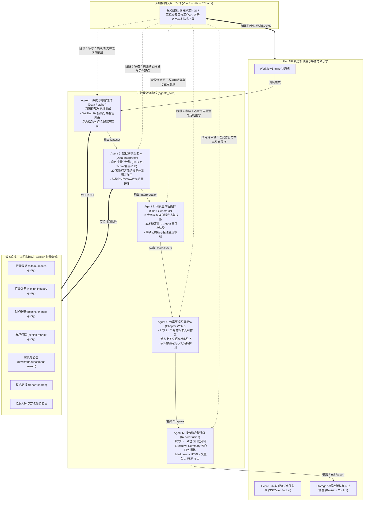

# 【A17】项目概要介绍：基于同花顺问财SkillHub的行业研究报告智能生成与人机协同优化系统

> **项目名称**：基于同花顺问财SkillHub的行业研究报告智能生成与人机协同优化系统  
> **所属赛题**：【A17】同花顺企业命题（智能体类别）  
> **系统代号**：A17-Industry-Research-Agent (A17-IRA)  
> **技术定位**：面向证券投研领域的新一代基础设施级五智能体流水线协同与全流程人机协作系统  

---

## 一、项目背景与核心痛点

### 1. 行业投研现状与效率瓶颈
行业研究报告是证券机构开展投资决策、资产定价和行业资产配置的基石。然而，传统行业研究面临着不可忽视的痛点：
1. **数据搜集效率低与信息孤岛**：传统分析师 60%~70% 的工作时间被机械性的数据检索（跨宏观、行业、三表财务、二级市场行情、资讯与研报）所占用，人工搜集容易出现口径错配与遗漏。
2. **研报撰写周期漫长**：一份高质量的万字深度行业专题报告（涵盖完整产业链解构、供需测算、竞争格局与财务估值），人工编写与校对周期通常长达 1~2 周，难以敏捷响应突发产业变革。
3. **通用大模型（LLM）的投研落地困境**：纯通用大模型缺乏权威实时的金融数据库支撑，存在致命的**数字幻觉**、时效性严重滞后、缺乏券商严谨的 7 章 21 节投研范式、图表生成脱节、且不支持人机中间断点介入。

### 2. 问财 SkillHub 的赋能价值
同花顺深耕金融数据二十余年，核心数据产品 iFinD 覆盖宏观、行业、财报、估值与资讯等全品类金融数据矩阵。同花顺率先推出的 **问财 SkillHub** 将专业金融能力标准化封装为可调用的 AI 技能生态。  
本项目正是以问财 SkillHub 为权威数据基础设施，通过现代多智能体流水线协同与人机协同优化机制，彻底打通从“自然语言需求输入”到“专业机构级行研报告输出”的智能化、工业化生产闭环。

---

## 二、系统定位与设计理念

本系统定位为**机构级行业研究报告智能生成工作台**，秉承三大核心设计理念：

```
                    ┌─────────────────────────────────────────────────────────┐
                    │               A17-IRA 三大核心设计理念                  │
                    └─────────────────────────────────────────────────────────┘
                                   │                   │
         ┌─────────────────────────┴────────┐ ┌────────┴────────────────────────┐
         │ 1. 流水线专业解耦 (Pipeline MAS) │ │ 2. 事实强锚定 (Evidence Grounding)│
         │ - 五阶段职责分明，拒绝单体黑盒   │ │ - 显式数据溯源，有效抑制幻觉     │
         │ - 标准 Schema 上下文流转传递     │ │ - 零轴防截断与严谨量化校验       │
         └──────────────────────────────────┘ └─────────────────────────────────┘
                                           │
                         ┌─────────────────┴─────────────────┐
                         │ 3. 全程人机协同 (Human-in-the-Loop)│
                         │ - 5大关键阶段设审核断点与纠偏通道 │
                         │ - AI 提效 90%，人类把关深度与合规 │
                         └───────────────────────────────────┘
```

1. **流水线专业解耦（Pipeline Multi-Agent）**：
   摒弃单 Agent 承担复杂长链路的低效模式，解耦为 5 个高度专业化、职责分明的独立智能体：数据获取智能体、数据解读智能体、图表生成智能体、分章节生成智能体与报告融合智能体。
2. **事实强锚定与证据链溯源（Evidence Grounding）**：
   底层数据均来源于问财 SkillHub 权威接口，系统为每条金融数据赋予全局唯一 `record_id`；报告中的核心数值、论点与图表显式引用事实源，极大抑制金融数据幻觉。
3. **全程人机协同闭环（Human-in-the-Loop, HITL）**：
   区别于“黑盒一键生成”，系统在数据获取、语义解读、图表生成、章节写作和最终融合 5 个阶段均提供人类交互审核与断点介入机制，支持审批流转、带风险放行、参数修改重跑及原条件重跑，实现人机协同的品质跃升。

---

## 三、核心创新点与技术特色

| 维度 | 传统人工投研模式 | 纯通用大模型（如 ChatGPT / Claude） | 本系统（A17-IRA + 问财 SkillHub） | 核心优势 |
| :--- | :--- | :--- | :--- | :--- |
| **数据源权威度** | 人工在多个终端拷贝，繁琐易错 | 基于训练集或联网搜索，时效滞后且口径杂乱 | **问财 SkillHub 官方与大师技能矩阵**（宏观、行业、财务、行情、资讯、研报等） | 权威金融底座支撑，毫秒级实时检索 |
| **数据真实性** | 人工核算，偶有输入失误 | **存在严重数字幻觉**，经常编造财务指标 | **强事实锚定（Grounding）网**，每个数值均带 `record_id` 显式溯源 | **有效抑制事实幻觉**，满足证券合规审计要求 |
| **架构协同性** | 缺乏标准化软件流程 | 单次超长 Prompt，上下文易溢出与遗忘 | **五阶段流水线多智能体架构**，FastAPI 状态机驱动，模块松耦合 | 各阶段独立测试，支持单阶段失败自愈 |
| **报告专业范式** | 券商标准专题报告框架 | 格式发散、行文泛泛、缺乏金融专业纵深 | **严格遵循国内头部券商专题研究的 7 章 21 节标准大纲体系** | 结构框架完整严谨，具备机构级投资洞察 |
| **图表生成能力** | 手工在 Excel / 绘图软件制作后贴入 | 无法直接生成研报级图表或仅出简陋文本表 | **自适应 8 大出版级图表家族**，ECharts 高保真本地渲染，防截断合规校验 | 图表与报告无缝内嵌，支持多形态转换 |
| **人机协同机制** | 缺乏协作工具 | 仅有全篇重新生成或简单对话修改 | **全生命周期人机协同工作台**：5 大审核断点、参数编辑、差异对比与版本追溯 | 分析师牢牢掌控核心假设，AI 提效 90% |

---

## 四、系统总体架构与业务全流程

本系统由前端协同工作台、后端状态机调度引擎、五大核心智能体算法集群及问财 SkillHub 基础设施层组成：



---

## 五、项目成效与量化产出

系统历经全量实战验证（如商业航天、低空经济、白酒、新能源车等赛道），取得了卓越的量化成效：

1. **研报产出时效缩减 90%+**：
   - 传统人工撰写 2 万字深度行业报告需 **5~10 个工作日**；
   - 系统端到端全自动运行仅需 **6~9 分钟**；
   - 人机协同深度介入精修后可在 **20~30 分钟内** 完成机构级高质量研报签发。
2. **权威数据深度覆盖与有效抑制事实幻觉**：
   - 调度涵盖宏观、行业、财务、行情、资讯、研报等 **8 类问财 SkillHub 技能**，单次任务捕获 **100+ 条高价值金融数据记录**；
   - 核心量化指标（营收、净利润、毛利率、ROE、PE、PB、CAGR 等）**全面绑定溯源证据链**，未查证数据主动提示“数据待披露”，坚决不虚构。
3. **严格对齐证券投研范式**：
   - 产出物完整覆盖 **7 章 21 节标准大纲**，图表内嵌数量达 **6~17 幅**，兼备定量分析表与定性研判。
4. **工程质量与全链路自愈**：
   - 拥有 **121 项高标准自动化单元与集成测试用例**，全链路覆盖意图路由、量化基线、图表防截断、反幻觉与断点恢复；
   - 支持产出 **Markdown**、**高交互 HTML** 与 **出版级矢量分页 PDF**（带双遍目录与精细页眉页脚）。
