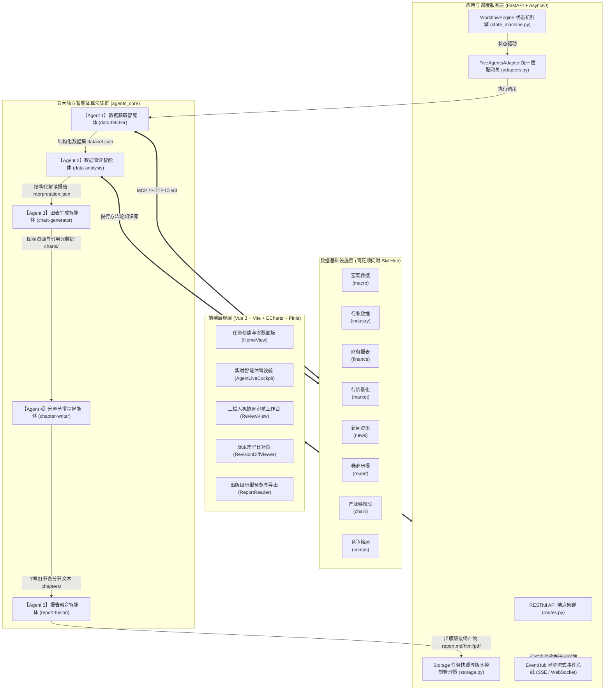
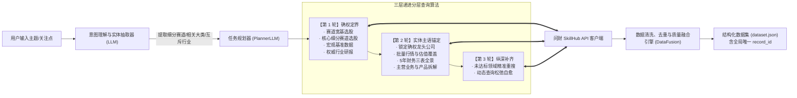
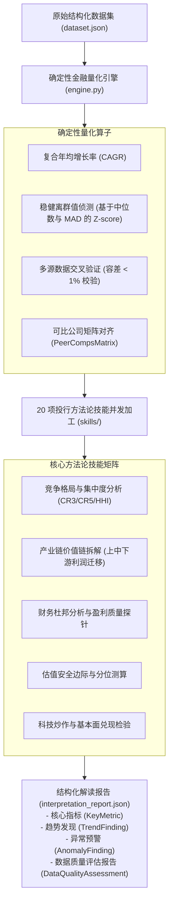
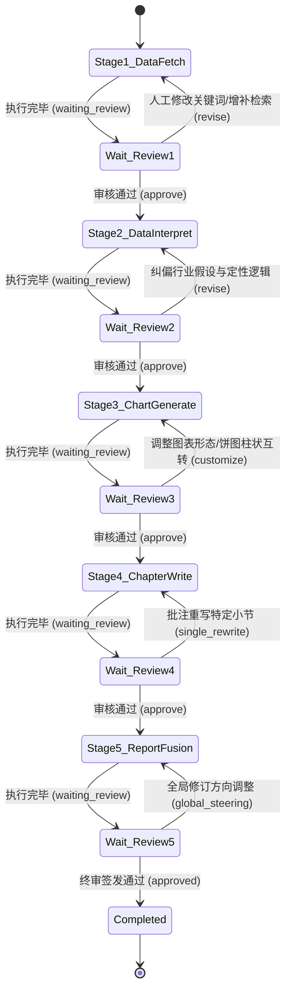

# 【A17】项目详细方案：基于同花顺问财SkillHub的行业研究报告智能生成与人机协同优化系统

> **项目名称**：基于同花顺问财SkillHub的行业研究报告智能生成与人机协同优化系统  
> **所属赛题**：【A17】同花顺企业命题（智能体类别）  
> **文档定位**：赛题交付材料（3）项目详细方案（系统深度技术白皮书）  
> **技术全景**：FastAPI 状态机调度引擎 + 五大专业智能体流水线 + 同花顺问财 SkillHub 技能矩阵 + 全生命周期人机协同工作台  

---

## 目录
1. [项目背景与系统需求分析](#一项目背景与系统需求分析)
2. [总体系统架构与技术选型](#二总体系统架构与技术选型)
3. [数据获取智能体设计与问财 SkillHub 编排（Agent 1）](#三数据获取智能体设计与问财-skillhub-编排agent-1)
4. [数据解读与金融知识抽取智能体设计（Agent 2）](#四数据解读与金融知识抽取智能体设计agent-2)
5. [数据可视化图表智能体设计（Agent 3）](#五数据可视化图表智能体设计agent-3)
6. [分章节内容生成智能体与反幻觉机制（Agent 4）](#六分章节内容生成智能体与反幻觉机制agent-4)
7. [报告融合生成与一致性审计智能体（Agent 5）](#七报告融合生成与一致性审计智能体agent-5)
8. [全流程人机协同（HITL）交互机制与状态机设计](#八全流程人机协同hitl交互机制与状态机设计)
9. [系统鲁棒性、安全合规与未来演进](#九系统鲁棒性安全合规与未来演进)

---

## 一、项目背景与系统需求分析

### 1. 业务背景与投研场景特征
在现代证券投资研究体系中，深度行业研究报告是连接宏观经济分析与个股定价决策的关键纽带。高质量的行业报告具备以下显著特征：
- **数据跨度广、颗粒度细**：涵盖宏观经济指标、中观行业产销供需、三表财务数据、二级市场交易行情以及高频行业新闻和上市公司公告。
- **分析框架高度规范化**：国内主流券商（如中信、中金、华泰等）形成了成熟的专题研究大纲，通常覆盖行业定义、供需演进、产业链利润迁移、竞争格局、代表企业财务、政策与技术催化以及情景风险测算（即 **7 章 21 节标准大纲范式**）。
- **合规审计要求极高**：金融研报对数字真实性实施“零容忍”，必须杜绝虚构数值，关键数据须具备明确出处凭据与可信来源。

### 2. 对标赛题任务要求与指标映射
系统严格对照《A17_同花顺问财SkillHub赛题说明.md》任务清单进行全功能闭环设计：

| 赛题技术指标 | 对应系统设计与实现模块 | 达成指标 |
| :--- | :--- | :--- |
| **（一）多技能协同与数据获取** | Agent 1 (`data-fetcher`)：多轮分层查询算法 + 问财 SkillHub 8 大官方核心技能矩阵 + 动态查询松弛 | 技能调用 ≥ 6 类（实达 8 类），单次抓取 100+ 结构化数据，跨行业噪声彻底隔离 |
| **（二）数据解读与知识抽取** | Agent 2 (`data-analysis`)：确定性金融量化引擎（CAGR、稳健 Z-score 异常侦测、容差 <1% 交叉验证）+ 20 项投行方法论技能 | 产出结构化知识包（JSON），自动标注单调性趋势与估值安全边际 |
| **（三）可视化图表自动生成** | Agent 3 (`chart-generator`)：8 大出版级图表家族 + 轻量 Spec 决策 + 本地确定性 ECharts 高保真编译渲染 | 图表内嵌 6~17 幅，零轴防截断合规，与章节论点精准关联绑定 |
| **（四）分章节内容生成** | Agent 4 (`chapter-writer`)：严格对齐 7 章 21 节标准大纲体系 + 动态语义检索注入 + 反幻觉事实锚定网 | 7章21节大纲框架完整覆盖，核心量化研判均携带 `[来源xx]` 显式溯源标签 |
| **（五）报告融合与一致性校验** | Agent 5 (`report-fusion`)：4 项审校技能 + 跨章节口径审计 + 自动提炼 Executive Summary | 统一术语表达，生成多通道出版级产物（Markdown / HTML / 矢量分页 PDF） |
| **（六）人机协同机制** | 人机协同交互工作台 + 后端事件总线：5 大关键阶段断点拦截、修改重跑、版本追溯与全自动模式切换 | 5 阶段全面覆盖，单次断点介入响应 < 200ms，支持 12+ 轮版本追溯 |

---

## 二、总体系统架构与技术选型

### 1. 系统总体架构拓扑图



### 2. 技术栈选型与架构决策

1. **后端与调度引擎**：
   - 采用 **Python 3.10+ / FastAPI**，原生支持异步并发（AsyncIO），保障高吞吐与长连接事件流传输。
   - 摒弃了早期脆弱的 Shell 脚本串联方式，自研基于有限状态机的 `WorkflowEngine`，确保每个阶段有据可依、断点可控。
2. **前后端通信协议**：
   - RESTful API 负责标准指令交互（创建任务、阶段审核、版本回滚、文件下载）；
   - SSE（Server-Sent Events）/ WebSocket 负责向下游前端流式实时推送 Agent 思考日志（`AgentTraceEvent`）、工具调用轨迹与状态变更。
3. **数据格式与契约校验**：
   - 全链路采用 **Pydantic V2** 强制类型校验，定义了严格的 `WorkflowState`、`StageResult` 与 `ReviewRequest`，避免跨模块字段解析异常。
4. **高质量渲染管道**：
   - 图表采用 Apache ECharts 本地静态编译，消除大模型长 JSON 耗时；
   - 最终研报采用 Playwright Headless Chromium 执行双遍排版（两遍计算生成真实页码与双栏目录），输出出版级高保真分页 PDF。

---

## 三、数据获取智能体设计与问财 SkillHub 编排（Agent 1）

数据获取智能体（`data-fetcher`）是整个报告生产的基石。其核心使命是：**面对用户发起的任意宽泛或专业的主题，精准拆解数据需求，组合调度问财 SkillHub 官方核心技能，并在极短时间内捕获高纯度、结构化的行业投研数据**。



### 1. 意图理解与实体抽取引擎
在接受用户输入后，`INTENT_SYSTEM_PROMPT` 驱动的意图模块执行四大任务：
- **概念净化与清洗**：提取标准的 `industry` 与核心 `focus_points`；
- **核心标的公司识别**：精准提炼用户明确关注的核心上市公司（如“商业航天”提炼出“中兴通讯、铖昌科技、中国卫星、海格通信”等），存入 `must_include_entities`；
- **细分环节拆解**：提炼 2~4 个最纯正的细分环节词槽（如商业航天的 `["卫星制造", "相控阵芯片", "地面测控", "低轨卫星互联网"]`）；
- **动态行业互斥划分**：自动推导相关行业大类（`relevant_industries`）与互斥行业大类（`excluded_industries`），例如商业航天互斥房地产、食品饮料等，从源头杜绝跨界巨头偏采。

### 2. “三层递进”分层查询算法
为了防止在单句查询中堆砌过多条件导致问财底层语义冲突或零召回，系统严密规划为三个递进层次：
1. **第一层：确权与定界（第 1 轮）**：
   - 目标：锁定真实属于该赛道的成分股标的池与宏观基准；
   - 调度：`hithink-astock-selector`（宽基与细分赛道选股，limit=20）、`hithink-macro-query`（宏观 GDP/规上工业同比）、`report-search`（权威深度研报检索）、`hithink-industry-query`（板块行业估值）。
2. **第二层：实体主语锚定（第 2 轮）**：
   - 目标：以第一层确权排名的真实龙头公司名称作为查询主语，彻底绝缘无关行业污染；
   - 调度：`hithink-market-query`（核心 8 家龙头行情与估值）、`hithink-finance-query`（前 3~4 家龙头近 5 年营收/净利/毛利率/ROE/研发费用率）、`hithink-business-query`（主营构成与分产品收入占比）。
3. **第三层：纵深拆解与闭环补齐（第 3 轮+）**：
   - 目标：针对 `requirement_coverage` 中尚未完全满足的领域或特定用户需求，进行单点精准定向补齐。

### 3. 动态查询松弛（Query Relaxation）与自愈机制
当问财返回数据为空或调用异常时，智能体具备多重自愈策略：
- **时间窗自动放宽**：若“近1年”无数据，自动放宽为“近3年”或“近5年”；
- **同义词替换与词槽剥离**：若复杂复合句查询解析失败，自动剥离修饰词，降级为基础关键词查询；
- **全局 record_id 强注入**：所有经 `DataFusion` 融合的数据统一打上全局唯一 UUID（如 `R-4fd3f9e8e10293e4`），并记录完整的数据来源渠道、报告期与采集时间。

---

## 四、数据解读与金融知识抽取智能体设计（Agent 2）

数据解读智能体（`data-analysis`）负责将原始的数值序列与表格转化为具有深刻投资洞察的结构化金融语义。



### 1. 确定性金融量化引擎
为杜绝纯大模型做加减乘除导致的计算幻觉，系统在 `engine.py` 中实现了纯 Python 确定性量化算法：
- **严谨财务计算**：对营收、净利、毛利率变动、研发费用率自动计算同比与 CAGR；
- **基于中位数与 MAD 的稳健离群值侦测**：
  $$\text{MAD} = \text{median}(|X_i - \text{median}(X)|), \quad \text{Robust } Z = 0.6745 \times \frac{X_i - \text{median}(X)}{\text{MAD}}$$
  精准识别出如商业航天板块中市盈率高达数千倍的极端概念炒作标的（如罗博特科 PE 7394 倍），并触发分层估值预警。
- **多源数据交叉验证（Cross Validation）**：对同一企业在不同技能中获取的财务数据（如行情接口的市值与财报接口的总股本×现价）进行容差校验（阈值设为 1%），若超过阈值自动在质检报告中披露。

### 2. 20 项投行方法论技能并发语义加工
系统内置并实现了 20 项投行分析方法论技能：
涵盖宏观周期传导、产业链传导、竞争格局集中度（CR3/CR5）、财务造假与雷区探测、科技生命周期（Gartner 曲线）对齐等。智能体并发调度方法论，提炼出三大核心产物：
1. **KeyMetric（核心量化指标库）**：经过单位换算（万亿/亿/万/%）标准化的全景指标；
2. **TrendFinding（趋势发现集合）**：携带单调性强度（Monotonicity Score）与方向（Up/Down/Stable）的研判；
3. **AnomalyFinding（异常风险集）**：包含极端估值、增收不增利、研发削减等关键预警。

---

## 五、数据可视化图表智能体设计（Agent 3）

数据可视化图表智能体（`chart-generator`）将结构化数据转化为符合证券研报出版标准的专业级图表。

### 1. 8 大出版级图表家族全覆盖
根据数据维度特征，智能体自动从决策矩阵中选取最佳图表形态：

| 图表家族名称 | 适用投研场景 | 典型样例 |
| :--- | :--- | :--- |
| **双轴时序组合图 (Combo Chart)** | 行业/企业总规模（左轴柱状）与同比增速（右轴折线） | 商业航天发射次数与增长率、核心公司近三年营收与增速 |
| **产业链拓扑全景图 (Topology Graph)** | 上中下游环节划分、核心标的与毛利率价值分布 | 商业航天产业链：上游芯片、中游制造、下游运营拓扑 |
| **四象限成长散点图 (Quadrant Scatter)** | 龙头标的估值水平 (PE/PB) 与成长性 (ROE/营收增速) 矩阵 | 成熟盈利标的 vs 高估值早期概念标的分层四象限 |
| **多系列发散水平条形图 (Bar Chart)** | 核心参与者关键指标对比（毛利率、研发费用率） | 铖昌科技、中兴通讯、中国卫星横向财务对标 |
| **企业综合财务雷达图 (Radar Chart)** | 龙头企业 5 维能力剖析（盈利、成长、杠杆、营运、研发） | 领军企业杜邦全景能力图谱 |
| **市场份额层级树图 (Treemap)** | 细分市场结构占比、竞争集中度切片 | 商业卫星发射入轨结构切片、分业务收入结构占比 |
| **多维相关性热力图 (Heatmap)** | 关键财务指标与宏观周期的相关性矩阵 | GDP增速与各细分赛道毛利率敏感性矩阵 |
| **敏感性压力矩阵图 (Sensitivity Matrix)** | 乐观/基准/悲观情景下的空间测算 | 卫星互联网渗透率与发射成本变化的敏感性矩阵 |

### 2. 轻量 Spec 决策 + 本地确定性 ECharts 高保真编译
传统方案让 LLM 直接吐出几百行复杂的 JavaScript/ECharts 字符串，容易造成超时或语法错误。本系统采用创新的**两段式编译架构**：
1. **LLM 阶段**：大模型仅需输出轻量级的语义 `ChartSpec`（指定图表类型、指标映射字段、标题、强调重点）；
2. **本地编译器阶段 (`compiler.py` + `render.py`)**：在本地 Python 环境中，通过确定性逻辑将 `ChartSpec` 和真实数据编译为标准的 ECharts JSON Option，并调用本地引擎静态渲染为高质量矢量 SVG/PNG。

### 3. 金融级可视化合规与美学校验 (`metric_guard.py` & `linter.py`)
- **零轴防截断强制校验**：针对柱状图，严格禁止截断 Y 轴起始值（避免视觉上放大微小差异造成误导）；
- **量纲对齐与双轴防冲突**：右轴百分比与左轴绝对金额严格隔离，杜绝单位污染；
- **研报专业调色板**：采用符合机构研报的藏青、同花顺红、钛金青等低饱和、高辨识度专业投研色系。

---

## 六、分章节内容生成智能体与反幻觉机制（Agent 4）

分章节内容生成智能体（`chapter-writer`）根据标准投研规范，逐一创作报告各章节。

### 1. 严格遵循 7 章 21 节券商标准大纲体系
系统在 `outline.py` 中将大纲固化为标准骨架：

```
CH-01: 行业定义与研究基础
  ├─ SEC-01-01: 行业定义、研究边界与证券范围
  ├─ SEC-01-02: 数据口径、研究时点与分析方法
  └─ SEC-01-03: 行业发展阶段与当前核心矛盾
CH-02: 市场规模与成长性
  ├─ SEC-02-01: 市场规模与历史增长趋势
  ├─ SEC-02-02: 需求驱动因素与细分市场变化
  └─ SEC-02-03: 供需关系、产能与行业周期
CH-03: 产业链与利润分配
  ├─ SEC-03-01: 上游资源、原材料与关键供应环节
  ├─ SEC-03-02: 中游核心产品、制造与服务环节
  └─ SEC-03-03: 下游需求、议价关系与利润迁移
CH-04: 竞争格局
  ├─ SEC-04-01: 市场结构、集中度与竞争阶段
  ├─ SEC-04-02: 主要参与者及其竞争位置
  └─ SEC-04-03: 竞争壁垒、差异化因素与潜在进入者
CH-05: 财务质量与估值参照
  ├─ SEC-05-01: 收入、利润与盈利能力
  ├─ SEC-05-02: 现金流、资产负债与财务质量
  └─ SEC-05-03: 估值水平、历史区间与跨市场可比性
CH-06: 宏观、政策与技术催化
  ├─ SEC-06-01: 宏观经济变量与行业传导路径
  ├─ SEC-06-02: 政策、监管与合规环境
  └─ SEC-06-03: 技术趋势、事件催化与监测指标
CH-07: 情景、风险与研究结论
  ├─ SEC-07-01: 基准、乐观和悲观三种情景
  ├─ SEC-07-02: 核心风险、反证条件与跟踪指标
  └─ SEC-07-03: 核心结论、适用边界与待验证事项
```

### 2. 动态上下文检索注入（Retriever）与并发创作
为了避免超长上下文导致模型丢失细节，`retriever.py` 为每个独立小节执行定制化上下文切片检索：
- 根据小节的研究目的（`purpose`），仅将与本节强相关的关键指标、趋势与图表元数据装配入 Prompt；
- 7 大章节采用异步并行编写（Async Concurrent Generation），各章节具备独立的局部自愈与局部降级容错机制。

### 3. 事实强锚定（Evidence Grounding）与反幻觉安全网
- **引用必带溯源**：模型在阐述任何财务数值、同比增速、公司地位时，强制在句尾嵌入引用角标（如 `[来源15,来源32]` 或 `[R-xxxx]`）；
- **结构化输出约束**：每个小节必须输出 **“本节要点”**、**“深度论述”**、**“定量对比表”** 与 **“待验证事项”**；
- **未达标主动披露**：如果数据源未覆盖某项指标（如某非上市标的财务），系统强制声明“该数据尚待披露”，严禁大模型胡乱估计。

---

## 七、报告融合生成与一致性审计智能体（Agent 5）

报告融合智能体（`report-fusion`）作为流水线总编审，负责产出最终的交付物。

### 1. 跨章节一致性与口径审计
智能体挂载 4 项投行主编审校技能：
1. **结构审计（Structure Audit）**：校验 7 章 21 节骨架是否存在遗漏，图表编号（Figure 1, Figure 2...）是否全局单调递增；
2. **术语与口径审计（Consistency Audit）**：跨章节比对同一标的的财务数值是否出现自相矛盾（如前文毛利 30% 后文变 40%）；
3. **图表关联性审计（Chart-Text Link Audit）**：确保正文中提及的图表编号在附图中均有物理实体；
4. **证据链审计（Evidence Cataloging）**：在文末自动生成全局数据溯源附录表。

### 2. Executive Summary 核心研判萃取
融合智能体从全篇 21 小节中高维提炼：
- **核心量化快照**：总市值、PE 中位数、上游毛利率、GDP 同比等看板指标；
- **分层核心研判**：区分成熟标的与早期主题概念，输出兼备深度与安全边际的投资论点；
- **风险提示总览**：将宏观传导、估值透支、数据边界风险集中列示。

### 3. 多通道出版级研报导出
- **Markdown (.md)**：全文本标准排版，带标准表格与图片超链接；
- **交互式 HTML (.html)**：基于 Jinja2 模板与精美 CSS 样式（米白研报质感），支持图表交互缩放；
- **出版级矢量 PDF (.pdf)**：通过 Playwright 驱动 Headless Chromium，结合 `@media print` 样式实现双遍排版（精确计算页码、自动分页与页眉页脚）。

---

## 八、全流程人机协同（HITL）交互机制与状态机设计

区别于传统的端到端“黑盒一键生成”，本系统将**全流程人机协同（Human-in-the-Loop）**作为核心竞争力。



### 1. 5 阶段人工交互审核协议
系统在每个阶段完成后暂停并推送 `waiting_review` 状态，前端三栏审核工作台激活对应的干预面板：
1. **阶段 1 数据获取审核**：
   - 用户可审视抓取到的数据条数、覆盖领域与代表企业；
   - 支持勾选调整检索范围，输入补充关键词，或发起“财务领域增量补采”；
2. **阶段 2 数据解读审核**：
   - 用户可审阅系统提炼的关键趋势与异常预警；
   - 支持人工注入专家背景知识（`expert_background`），该知识将强力穿透并指导后续撰写；
3. **阶段 3 图表生成审核**：
   - 用户在 ECharts 画廊中实时预览各幅图表；
   - 支持**图表动态形态变形（Morph）**：例如点击将分组柱状图一键转为横向条形图或面积图；支持新增图表诉求（如“加个饼图”）；
4. **阶段 4 章节撰写审核**：
   - 用户可逐章审阅段落与论据；
   - 支持**单章节定向重写**：针对特定章节输入指令（如“针对 CH-01 提升下行风险与估值安全边际论述”），系统仅重写该章节并保持其余章节不变；
5. **阶段 5 报告融合终审**：
   - 用户可指定全局修订方向（如“中立客观 / 深度对标”）；
   - 支持“完全通过（Approve）”或“带保留交付（Accept with risks）”。

### 2. 状态机断点控制与版本追溯（Revision Control）
- **版本快照机制**：每次人工触发干预，`WorkflowEngine` 自动递增 `revision`（如 Rev 1 -> Rev 2 -> Rev 3），并将完整的输入、输出、事件历史与产物文件归档至 `revisions/` 目录；
- **版本差异比对**：前端提供 `RevisionDiffViewer`，分析师可直观对比两次修订前后的文字修改与指标变动；
- **全自动模式支持**：系统同时支持“全自动（一键通过）”模式，在非介入状态下无缝自动流转，满足快速批量产出需求。

---

## 九、系统鲁棒性、安全合规与未来演进

### 1. 鲁棒性与异常防护体系
- **局部失败降级**：若单小节模型推理出现暂时性错误，仅对该小节触发本地重试与兜底逻辑，不影响其他 20 个小节的正常产出；
- **接口熔断与安全限流**：针对问财 SkillHub 接口调用设置并发上限与指数退避重试（Exponential Backoff）；
- **状态自愈与断点续跑**：若系统因异常重启，`state_machine.py` 能自动从 `state.json` 恢复中断任务，并智能检测前置依赖完整性。

### 2. 金融合规与审计跟踪
- 全文数据显式标注时效时点（如 `2026-09-29` 报告期），提示数据有效边界；
- 对无法获取或未披露的数据严禁生成，强制提示“待后续公开披露验证”；
- 形成完整的运行事件审计台账（`events.jsonl`），实现从用户请求到终稿的完整数字足迹归档。

### 3. 未来演进路线
- **跨周期模型演进**：引入时间序列因果推断模型，深化行业景气度预测能力；
- **买方自建模型集成**：支持机构接入自有的 DCF / DDM / 自由现金流折现估值组件；
- **协同工作流扩展**：支持多位分析师协同在线协同标注与研报联合评审。
