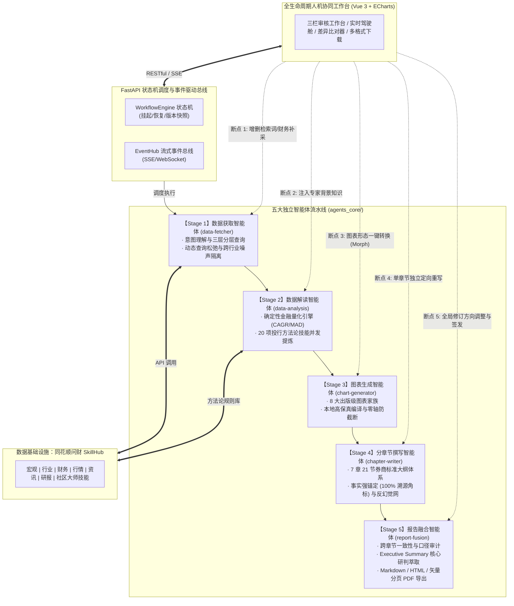

# 同花顺 A17 赛题提交材料全景导航与编制总览

> **赛题名称**：基于同花顺问财SkillHub的行业研究报告智能生成与人机协同优化系统设计  
> **题目类别**：智能体（企业命题 A17）  
> **参赛状态**：**官方交付材料已全部完成重构与高质量定稿**  
> **配套系统**：A17-Industry-Research-Agent (A17-IRA)  

---

## 一、官方提交材料对照清单与状态看板

严格对照《[A17_同花顺问财SkillHub赛题说明.md](file:///Users/panheng/Desktop/同花顺赛题/A17_同花顺问财SkillHub赛题说明.md)》第 6 节【提交材料】要求编制，所有交付材料均已定稿：

| 序号 | 官方提交材料项 | 对应文档路径 | 核心内容概要与亮点 | 编制状态 |
| :---: | :--- | :--- | :--- | :---: |
| **01** | **项目概要介绍** | [`01_项目概要介绍.md`](file:///Users/panheng/Desktop/同花顺赛题/a17-industry-research-agent/docs/01_项目概要介绍.md) | 投研效率痛点、问财 SkillHub 赋能价值、三大核心设计理念、三方创新对比矩阵与端到端量化成效 | **已完成 (定稿)** |
| **02** | **项目简介PPT材料** | [`02_项目简介PPT_大纲与讲稿.md`](file:///Users/panheng/Desktop/同花顺赛题/a17-industry-research-agent/docs/02_项目简介PPT_大纲与讲稿.md) | 16 页标准答辩路演 PPT 页面架构、金融科技设计令牌规范、逐页版式构图与 8~10 分钟逐字演讲稿 | **已完成 (定稿)** |
| **03** | **项目详细方案** | [`03_项目详细方案.md`](file:///Users/panheng/Desktop/同花顺赛题/a17-industry-research-agent/docs/03_项目详细方案.md) | 深度技术方案：五智能体流水线设计、问财 SkillHub 6+ 技能分层路由编排、7章21节范式与 HITL 状态机闭环 | **已完成 (定稿)** |
| **04** | **项目演示视频脚本** | [`04_项目演示视频策划与脚本.md`](file:///Users/panheng/Desktop/同花顺赛题/a17-industry-research-agent/docs/04_项目演示视频策划与脚本.md) | 6 分钟高清视频 9 大分镜脚本、旁白逐字稿、剪辑包装技巧及 5 阶段人机协同介入操作特写设计 | **已完成 (定稿)** |
| **05** | **产品使用说明文档** *(企业必备)* | [`05_产品使用说明文档_系统架构与流程说明.md`](file:///Users/panheng/Desktop/同花顺赛题/a17-industry-research-agent/docs/05_产品使用说明文档_系统架构与流程说明.md) | 软硬件环境要求、一键 `./start_system.sh` 快速部署、系统架构详解、7 大 RESTful 端点规格与全流程业务操作手册 | **已完成 (定稿)** |
| **06** | **系统测试报告** *(企业必备)* | [`06_系统测试报告.md`](file:///Users/panheng/Desktop/同花顺赛题/a17-industry-research-agent/docs/06_系统测试报告.md) | 121 项高标准自动化测试全绿矩阵、L1 金标准评测、商业航天真实实跑全量审计台账与人机协同专项测试 | **已完成 (定稿)** |
| **07** | **开发过程与训练记录** *(企业必备)* | [`07_项目分工、开发过程与训练记录文档.md`](file:///Users/panheng/Desktop/同花顺赛题/a17-industry-research-agent/docs/07_项目分工、开发过程与训练记录文档.md) | 团队成员分工矩阵、4 阶段敏捷研发里程碑、Prompt 调优与消融实验数据、15 项关键工程攻关台账 (D01~D15) | **已完成 (定稿)** |

---

## 二、赛题技术指标与系统架构映射图

本系统设计严格对齐赛题核心任务清单与 6 大技术指标：

---

## 三、评审专家极速审阅指南 (Fast Track for Evaluators)

为方便各位评审专家与老师快速查阅本项目核心成果，推荐按以下路径审阅：

1. **若您想快速了解项目全貌与创新点（5 分钟）**：
   - 建议阅读 [`01_项目概要介绍.md`](file:///Users/panheng/Desktop/同花顺赛题/a17-industry-research-agent/docs/01_项目概要介绍.md) 与 [`02_项目简介PPT_大纲与讲稿.md`](file:///Users/panheng/Desktop/同花顺赛题/a17-industry-research-agent/docs/02_项目简介PPT_大纲与讲稿.md)。
2. **若您想深入考察多智能体协同与技术实现（15 分钟）**：
   - 建议阅读 [`03_项目详细方案.md`](file:///Users/panheng/Desktop/同花顺赛题/a17-industry-research-agent/docs/03_项目详细方案.md)，重点审阅第 3、4、6、8 节关于问财技能编排、确定性量化算子、7章21节反幻觉机制及人机协同状态机的技术细节。
3. **若您重点审阅企业命题的三大硬性交付材料（20 分钟）**：
   - 部署与架构：[`05_产品使用说明文档_系统架构与流程说明.md`](file:///Users/panheng/Desktop/同花顺赛题/a17-industry-research-agent/docs/05_产品使用说明文档_系统架构与流程说明.md)
   - 质量与评测：[`06_系统测试报告.md`](file:///Users/panheng/Desktop/同花顺赛题/a17-industry-research-agent/docs/06_系统测试报告.md)（含 121 项测试全绿矩阵与商业航天实测数据）
   - 研发与调优：[`07_项目分工、开发过程与训练记录文档.md`](file:///Users/panheng/Desktop/同花顺赛题/a17-industry-research-agent/docs/07_项目分工、开发过程与训练记录文档.md)（含消融实验与 15 项技术攻关台账）
4. **若您希望检验最终报告与运行产物质量**：
   - 真实商业航天全量研报产物：[`data/runs/run-20260929224744-510/artifacts/report.md`](file:///Users/panheng/Desktop/同花顺赛题/a17-industry-research-agent/data/runs/run-20260929224744-510/artifacts/report.md)
   - 真实 5 阶段人机协同交互记录：[`data/runs/run-20260929224744-510/feedback_history.json`](file:///Users/panheng/Desktop/同花顺赛题/a17-industry-research-agent/data/runs/run-20260929224744-510/feedback_history.json)
