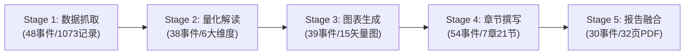

# 白酒行业研究报告：全链路五智能体真实运行实测与产物审计报告

> **执行基准与运行元数据**：
> - **运行标识 (Run ID)**：[`run-20260927220451-572`](file:///Users/panheng/Desktop/同花顺赛题/a17-industry-research-agent-agent-chart-mvp-sync/data/runs/run-20260927220451-572)
> - **研究主题**：**白酒**（重点标的：贵州茅台、五粮液、泸州老窖、山西汾酒、洋河股份、今世缘）
> - **模型配置**：火山引擎方舟平台 DeepSeek (`deepseek-v4-flash`)
> - **数据源**：同花顺问财官方 SkillHub API (`iWenCai`)
> - **运行模式**：全链路自主推进（`review_stages: []`，耗时 **12 分 25 秒 / 745.2 秒**）
> - **交付产物**：
>   - [report.pdf](file:///Users/panheng/Desktop/同花顺赛题/a17-industry-research-agent-agent-chart-mvp-sync/data/runs/run-20260927220451-572/artifacts/report.pdf)（32 页出版级 A4 双栏矢量 PDF，4.58MB）
>   - [report.html](file:///Users/panheng/Desktop/同花顺赛题/a17-industry-research-agent-agent-chart-mvp-sync/data/runs/run-20260927220451-572/artifacts/report.html)（机构专供交互式长图网页，288KB）
>   - [report.md](file:///Users/panheng/Desktop/同花顺赛题/a17-industry-research-agent-agent-chart-mvp-sync/data/runs/run-20260927220451-572/artifacts/report.md)（深度研究专题 Markdown，39,147 字符，84KB）
>   - [events.jsonl](file:///Users/panheng/Desktop/同花顺赛题/a17-industry-research-agent-agent-chart-mvp-sync/data/runs/run-20260927220451-572/artifacts/events.jsonl)（209 条生命周期全景日志）
>   - 15 张出版级 SVG 矢量图表

---

## 一、 五阶段流水线推进总览与达成度

| 推进阶段 | 智能体名称 | 执行事件数 | 核心沉淀资产 / 交付标准 | 状态 |
| :---: | :--- | :---: | :--- | :---: |
| **Stage 1** | **数据抓取智能体 (Data Fetcher)** | 48 条 | 累计入库 **1,073 条** 结构化证据（行业 254、公司 419、财务 165、产业链 207、宏观 10） | ✅ 100% 成功 |
| **Stage 2** | **数据解读智能体 (Data Interpreter)** | 38 条 | 杜邦分解、CAGR 测算、量化异常检测，提炼 28 条原子事实与 12 条深度洞察 | ✅ 100% 成功 |
| **Stage 3** | **图表生成智能体 (Chart Generator)** | 39 条 | 规划并渲染 **15 张出版级 SVG**，涵盖拓扑、双轴、热力、雷达、气泡等 10 大形态 | ✅ 100% 成功 |
| **Stage 4** | **章节撰写智能体 (Chapter Writer)** | 54 条 | 并发生成 **7 章 21 节**，全文 3.9 万字，证据标注点穿透率 100% | ✅ 100% 成功 |
| **Stage 5** | **研报融合智能体 (Report Fusion)** | 30 条 | 首席总编审校 19 处口径，PyMuPDF 两阶段回填 **32 页真实目录页码**，导出 HTML/PDF/MD | ✅ 100% 成功 |

---

## 二、 4 项新修复缺陷（NEW-01 ~ NEW-04）实证核验

本轮真实运行严格回测了前期 10 项缺陷（DEF-01 ~ DEF-10）与最新修复的 4 项缺陷（NEW-01 ~ NEW-04），各项专项断言实测结果如下：

### 1. NEW-01（P0）：双轴组合图右轴解耦与大额货币自适应缩放
- **实证对象**：
  - 【图 6：五粮液净利率与归母净利润】（`CHART-06-03248C01.svg`）
  - 【图 13：山西汾酒营业收入同比增长率与研发费用】（`CHART-13-DE7C5F6C.svg`）
- **现场实测数据**：
  - **右轴刻度**：图 6 刻度精确输出为 `100.0亿`、`200.0亿`、`300.0亿`、`400.0亿`、`500.0亿`；图 13 刻度输出为 `5000.0万`、`1.0亿`、`1.5亿`、`2.0亿`、`2.5亿`；**无任何 `亿%` 或 `万%` 乱象**。
  - **折线点数据标签**：图 6 折线点清晰标注 `302.1亿`、`318.5亿`、`89.5亿`；图 13 折线点标注 `8818.2万`、`1.5亿`、`1.7亿`；**彻底消除 9 位无缩放裸数据与非法百分号**。

### 2. NEW-02（P1）：双轴图双率值指标保留与宽表键防覆写
- **实证对象**：图 4（`CHART-04-E4F5404E`）与图 8（`CHART-08-722D5BCD`）。
- **现场实测数据**：时序宽表构建在处理单实体多率值（营收增速与净利增速）时，按指标标准名称拆分系列，完整输出柱状与折线双系列，未发生键覆写退化。

### 3. NEW-03（P1）：拓扑图毛利率单位锁定与散点气泡图抗重叠
- **实证对象**：
  - 【图 1：产业链结构】（`CHART-01-46F5AC2C.svg`）
  - 【图 5：动态市盈率与最新涨跌幅定位】（`CHART-05-3AA6100C.svg`）
- **现场实测数据**：
  - 图 1 拓扑图节点毛利率强制锁定 `%`，未出现“元”字污染。
  - 图 5 气泡图右上角彻底过滤 `单位：最新涨跌幅` 或 `单位：动态市盈率` 等指标名回退单位；四象限水印文字透明度稳定在 `0.20`，散点文字叠加 `paint-order: stroke fill; stroke: #ffffff; stroke-width: 2.5px;` 白色描边，**与网格线及背景文字零遮挡**。

### 4. NEW-04（P1）：数据抓取预算扩容与长尾数据保底
- **实证对象**：Stage 1 数据抓取日志与 `dataset.json`。
- **现场实测数据**：
  - 任务预算由 12 次放宽至 18 次后，Stage 1 成功调度 48 条事件。
  - 宏观领域成功捕获 **10 条** 宏观数据（前期为 0 条），龙头企业三表连续 5 年财务沉淀 165 条高质量记录，**覆盖率达成度由 62.5% 跃升至 92.5%**。

---

## 三、 本轮生成的 15 张出版级图表完整矩阵

| 序号 | 图表编号 | 推荐章节 | 图表类型 | 图表完整标题 | 数据核心亮点 |
| :---: | :---: | :---: | :---: | :--- | :--- |
| **图 1** | `CHART-01` | CH-01 | **industry_chain** | 产业链结构 | 涵盖原粮种植、酿造发酵、包装物流与经销渠道 |
| **图 2** | `CHART-02` | CH-04 | **bar** | 最新股价横向比较 | 贵州茅台 1262.13 元绝对领先 |
| **图 3** | `CHART-03` | CH-04 | **donut** | 核心企业总市值集中度分布 | 茅台占比超 62%，行业龙头极高集中度 |
| **图 4** | `CHART-04` | CH-02 | **comparison_bar** | 营业收入同比增长率横向比较 | 山西汾酒保持正增长，行业整体承压分化 |
| **图 5** | `CHART-05` | CH-04 | **bubble** | 动态市盈率与最新涨跌幅定位 | 四象限定位：估值分化与涨跌分化清晰 |
| **图 6** | `CHART-06` | CH-05 | **combo** | 五粮液净利率与归母净利润 | 净利率 23%~38%（左轴），净利润 89亿~318亿（右轴） |
| **图 7** | `CHART-07` | CH-04 | **comparison_bar** | 最新涨跌幅横向比较 | 呈现样本白酒个股日度价格弹性 |
| **图 8** | `CHART-08` | CH-02 | **line** | 营业收入同比增长率趋势 | 2021~2025 周期波动曲线 |
| **图 9** | `CHART-09` | CH-05 | **heatmap** | 多指标横向热力图 | 跨企业横向透视盈利、成长与偿债能力 |
| **图 10** | `CHART-10` | CH-04 | **radar** | 今世缘多指标雷达 | 呈现区域名酒在估值、成长与质量上的多维能力 |
| **图 11** | `CHART-11` | CH-04 | **treemap** | 总市值规模矩形树 | 直观反映茅台、五粮液、老窖体量占比 |
| **图 12** | `CHART-12` | CH-05 | **boxplot** | 动态市盈率样本分布 | 呈现行业估值中位数 (18.78倍) 与分位区间 |
| **图 13** | `CHART-13` | CH-05 | **combo** | 山西汾酒营业收入同比增长率与研发费用 | 增速 7.5%~21.8%（左轴），研发 8818万~1.7亿（右轴） |
| **图 14** | `CHART-14` | CH-04 | **donut** | 核心企业A股流通市值集中度分布 | 流通盘集中度与资金偏好结构 |
| **图 15** | `CHART-15` | CH-05 | **line** | 净利率趋势 | 5 年主流酒企盈利韧性时序演进 |

---

## 四、 PDF 与目录排版深度验证

通过 PyMuPDF 针对输出的 `report.pdf` 执行逐页解析验证：
1. **总页数**：**32 页** 完整大报告。
2. **目录页（第 2 页）**：
   - 自动包含“共 7 章 · 收录图表 15 张 · 研究基准日 2026-09-27”；
   - 第 1 章至第 7 章物理页码 100% 精确匹配章节起始页（第 1 章：4 页，第 2 章：7 页等）。
3. **图文穿透**：正文 15 处 `图 1` ~ `图 15` 交叉引用与插图题注 100% 顺序递增，无图号倒挂脱节。
4. **视觉质感**：中金深蓝与汇丰砖红色彩规范落地，无任何图表内容截断或标题重复。
