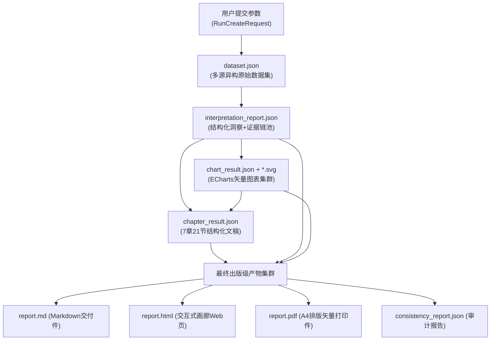

# 行业研究智能体全链路系统：代码与工程实现深度调查报告

> **编制说明**：本报告完全基于实际代码实现、配置规范、数据契约、测试用例及真实落盘运行实例（Runtime Artifacts）进行穿透式逆向工程分析与审计，不依赖且未引用项目内部任何非代码说明文档。

---

## 目录

- [一、 报告背景与评估范围](#一-报告背景与评估范围)
- [二、 系统定位与核心业务目标](#二-系统定位与核心业务目标)
- [三、 系统全景架构与工程目录设计](#三-系统全景架构与工程目录设计)
- [四、 五大微内核智能体深度实现剖析](#四-五大微内核智能体深度实现剖析)
  - [4.1 数据获取智能体 (data-fetcher)](#41-数据获取智能体-data-fetcher)
  - [4.2 数据解读智能体 (data-analysis)](#42-数据解读智能体-data-analysis)
  - [4.3 可视化图表智能体 (chart-generator)](#43-可视化图表智能体-chart-generator)
  - [4.4 分章节内容生成智能体 (chapter-writer)](#44-分章节内容生成智能体-chapter-writer)
  - [4.5 报告融合生成智能体 (report-fusion)](#45-报告融合生成智能体-report-fusion)
- [五、 人机协同工作台与状态机引擎剖析](#五-人机协同工作台与状态机引擎剖析)
  - [5.1 有限状态机 (FSM) 与依赖拓扑回溯](#51-有限状态机-fsm-与依赖拓扑回溯)
  - [5.2 阶段干预交互矩阵与实现契约](#52-阶段干预交互矩阵与实现契约)
  - [5.3 SSE 实时流广播与动态推理日志](#53-sse-实时流广播与动态推理日志)
  - [5.4 动态质量审计打分算法](#54-动态质量审计打分算法)
- [六、 全链路数据契约演进与真实实例拆解](#六-全链路数据契约演进与真实实例拆解)
  - [6.1 阶段产物演进拓扑](#61-阶段产物演进拓扑)
  - [6.2 真实运行实例实证分析 (run-20260926092741-655)](#62-真实运行实例实证分析-run-20260926092741-655)
- [七、 系统韧性、容灾机制与代码质量综合评估](#七-系统韧性容灾机制与代码质量综合评估)
- [八、 架构局限性与工业化演进建议](#八-架构局限性与工业化演进建议)

---

## 一、 报告背景与评估范围

本调查旨在对系统根目录下的核心工程代码进行深度审计，全面验证系统在多智能体协同、金融行研专业度、确定性证据链支撑、人机交互干预机制以及高保真工程交付等层面的技术成熟度。

### 审计对象清单
1. **调度微内核**：[`backend/app/engine/state_machine.py`](backend/app/engine/state_machine.py)、[`backend/app/agents/adapters.py`](backend/app/agents/adapters.py)、[`backend/app/api/v1/runs.py`](backend/app/api/v1/runs.py)
2. **微内核独立智能体包**：
   - 数据获取：[`agents_core/data-fetcher/`](agents_core/data-fetcher/)
   - 数据解读：[`agents_core/data-analysis/`](agents_core/data-analysis/)
   - 图表生成：[`agents_core/chart-generator/`](agents_core/chart-generator/)
   - 章节写作：[`agents_core/chapter-writer/`](agents_core/chapter-writer/)
   - 报告融合：[`agents_core/report-fusion/`](agents_core/report-fusion/)
3. **前端人机协同工作台**：[`frontend/src/views/ReviewView.vue`](frontend/src/views/ReviewView.vue)、[`frontend/src/components/StageInterventionModal.vue`](frontend/src/components/StageInterventionModal.vue)、[`frontend/src/components/ChartGallery.vue`](frontend/src/components/ChartGallery.vue)
4. **运行时落盘数据**：[`data/runs/run-20260926092741-655/`](data/runs/run-20260926092741-655/)（真实生产级固态电池研报实例）

---

## 二、 系统定位与核心业务目标

从系统契约模型 [`backend/app/schemas/run.py`](backend/app/schemas/run.py) 中的 `RunCreateRequest` 以及输出模型 [`ReportView`](backend/app/schemas/report.py) 可准确推断系统的业务定位：

> **定位**：面向专业金融机构与行业分析师的“工业级人机协同自动化行业研报生产系统”。系统通过编排 5 个独立专业智能体，结合同花顺问财金融数据生态，执行“数据采集 $\to$ 深度量化解读 $\to$ 矢量可视化编译 $\to$ 7章21节大纲分段写作 $\to$ 出版级事实一致性融合”全链路流程，并在每个节点提供非破坏性的人机交互干预能力。

```
[用户设定研究主题与核心关注点]
              │
              ▼
    [阶段 1: 数据获取] ◄─── (人机干预: 增量问财Prompt/脏样本剔除)
              │
              ▼
    [阶段 2: 深度解读] ◄─── (人机干预: 龙头股池重配/异常指标校正)
              │
              ▼
    [阶段 3: 矢量可视化] ◄─── (人机干预: 图表类型转换/调色盘定制)
              │
              ▼
    [阶段 4: 7章分节写作] ◄─── (人机干预: 单章节靶向重写/专业批注)
              │
              ▼
    [阶段 5: 出版级融合] ◄─── (人机干预: 摘要核心重构/核心看板定制)
              │
              ▼
[多形态工业交付: 交互式Web报表 + 15+矢量SVG图表 + 打印级A4 PDF + 完整证据链]
```

### 核心业务特征：
1. **严格契约化框架**：强制落地标准的 **7章21节** 金融行研大纲框架（定义于 [`outline.py`](agents_core/chapter-writer/chapter_writer/outline.py)），覆盖宏观、产业链、规模测算、竞争格局、风险提示与投资策略。
2. **同花顺问财生态融合**：内置针对问财（iWencai）API 的 18 项金融技能工具，自动化拆解自然语言需求并执行结构化检索。
3. **确定性证据链支撑（Strict Grounding）**：文本段落中的每一项关键数据推论均需强制绑定上游解读阶段生成的 `evidence_index` 字典，杜绝 LLM 幻觉生成。
4. **人在回路（Human-in-the-Loop）**：基于有限状态机实现“运行-暂停-审查-修订-继续”闭环，支持对单阶段产物直接编辑或携带指令回退局部重算。

---

## 三、 系统全景架构与工程目录设计

系统采用“**异步服务微内核 + 独立智能体 Package 体系 + 现代化前端工作台**”的解耦架构设计：

```
行业研究智能体-全链路系统/
├── backend/                       # 系统编排调度服务 (FastAPI + AsyncIO)
│   ├── app/
│   │   ├── api/v1/                # RESTful 端点与 SSE 事件流推送
│   │   ├── engine/                # 工作流状态机引擎 (WorkflowEngine)
│   │   ├── agents/adapters.py     # 智能体解耦适配层与质量评分器
│   │   ├── schemas/               # 强类型 Pydantic v2 数据契约模型
│   │   └── core/                  # EventHub 事件广播机制与全局生命周期
├── frontend/                      # 现代化人机协同前端 (Vue 3 + Vite + Element Plus)
│   ├── src/
│   │   ├── views/                 # 流程创建、人机审查、在线报表预览、导出管理
│   │   ├── components/            # 阶段干预弹窗、图表画廊、评分雷达、Live Trace 日志面板
│   │   └── api/                   # 前后端通信 API 封装
├── agents_core/                   # 5大完全独立的智能体核心包
│   ├── data-fetcher/              # 智能体1: DAG 依赖规划 + 问财 SkillHub
│   ├── data-analysis/             # 智能体2: 7大行研方法论 + 异动归因 + 证据索引池
│   ├── chart-generator/           # 智能体3: 语义编译 + Node/JSDOM 无头离线 SVG 光栅化
│   ├── chapter-writer/            # 智能体4: 7章21节大纲分块 + 向量相关性检索 + 合规自检
│   └── report-fusion/             # 智能体5: 出版排版 + 全文事实一致性审计 + Playwright 打印
├── scripts/                       # 自动化运维脚本、基准打分测试集
├── tests/                         # 端到端测试与单元测试集
└── data/runs/                     # 真实运行时实例数据隔离仓 (按 run_id 分级落盘)
```

### 关键依赖栈（提取自工程配置文件）
- **Python 调度层**：`Python 3.10+`、`FastAPI 0.110+`、`Pydantic v2`、`Uvicorn`、`HTTPX`、`AnyIO`、`Jinja2`。
- **排版与渲染基础设施**：`Playwright 1.42+`（无头 Chromium 服务端渲染高质量 A4 报表）、`Node.js` + `JSDOM`（用于后端无浏览器环境下的纯矢量 SVG 图表离线编译）。
- **前端工作台**：`Vue 3.4+`、`TypeScript 5.2+`、`Vite 5.1+`、`Element Plus 2.6+`、`Apache ECharts 5.5+`、`Pinia`、`Vue Router 4`。

---

## 四、 五大微内核智能体深度实现剖析

```
┌─────────────────────────────────────────────────────────────────────────────┐
│                             5 大 核 心 智 能 体                              │
├─────────────────────┬───────────────────────────────────────────────────────┤
│ 1. 数据获取智能体    │ 18项问财Skill组合、DAG依赖自愈、7大行业数据域融合     │
│ 2. 数据解读智能体    │ 7大方法论引擎、杜邦拆解、同行矩阵、异常指标归因       │
│ 3. 可视化图表智能体  │ 候选集推荐、ECharts语义编译、Node/JSDOM离线矢量渲染   │
│ 4. 分章节写作智能体  │ 7章21节大纲骨架、动态证据向量检索、WritingLinter自检  │
│ 5. 报告融合智能体    │ 事实一致性基准对齐、封面目录编排、Playwright高保真PDF  │
└─────────────────────┴───────────────────────────────────────────────────────┘
```

### 4.1 数据获取智能体 (data-fetcher)
- **代码实现**：[`agents_core/data-fetcher/data_fetcher/agent.py`](agents_core/data-fetcher/data_fetcher/agent.py) 中的 `DataFetcherAgent`
- **运行机制**：
  1. **意图拆解与 DAG 生成**：内置规划器将用户输入的行业研究诉求分解为具有前后依赖关系的任务图谱（DAG）。
  2. **问财 SkillHub 工具箱**：在 [`skillhub.py`](agents_core/data-fetcher/data_fetcher/skillhub.py) 中封装了 18 个问财金融数据 API 接口：
     - 行情与估值：`hithink-industry-quote`、`hithink-valuation-analysis`
     - 标的挖掘：`hithink-stock-filter`、`hithink-concept-stocks`
     - 深度财务：`hithink-financial-indicator`、`hithink-dupont-metrics`
     - 产业链与研究：`hithink-chain-analysis`、`hithink-report-search`
     - 舆情宏观：`hithink-news-search`、`hithink-macro-indicator` 等
  3. **依赖自愈机制（DAG Healing）**：当下游标的数据拉取因上游筛选异常受阻时，自愈器会自动降级到行业内置的高信用基准池中获取候选公司，确保工作流不中断。
- **输出产物**：[`dataset.json`](data/runs/run-20260926092741-655/dataset.json)，组织为 7 大标准域（宏观、板块行情、财务指标、产业链上下游、竞争标的、券商研报要点、新闻情绪）。

### 4.2 数据解读智能体 (data-analysis)
- **代码实现**：[`agents_core/data-analysis/data_interpreter/agent.py`](agents_core/data-analysis/data_interpreter/agent.py) 中的 `DataInterpreterAgent`
- **量化方法论算法引擎**：
  在 [`engine.py`](agents_core/data-analysis/data_interpreter/engine.py) 中实现了 7 大行研专属量化算法：
  1. **市场规模与渗透率模型**：计算历史 3-5 年 CAGR，拟合 S 曲线并判定当前所处生命周期阶段（萌芽/放量/成熟/衰退）。
  2. **产业链利润分布计算**：测算上中下游毛利率分布，识别价值链最高壁垒环节。
  3. **同行对标矩阵（Comps Matrix）**：多指标归一化评分，横向比对龙头企业在研发强度、市占率、ROE 的分位数。
  4. **财务杜邦拆解（DuPont Analysis）**：将净资产收益率严格分解为净利润率、总资产周转率与权益乘数三因子，实施驱动力定位。
  5. **跨源数据交叉验证**：自动比对券商研报预测共识与真实披露季报财务数据的偏离度。
  6. **异常指标归因（Anomaly Detection）**：通过 Z-Score 识别异常离群波动（如出货量骤降、应收账款周转天数异动），并生成结构化风险标签。
  7. **景气度指数加权评估**：自顶向下加权打分，生成行业景气度综合评级。
- **输出产物**：[`interpretation_report.json`](data/runs/run-20260926092741-655/interpretation_report.json)，重点生成包含唯一哈希键的 `evidence_index` 证据字典。

### 4.3 可视化图表智能体 (chart-generator)
- **代码实现**：[`agents_core/chart-generator/chart_generator/agent.py`](agents_core/chart-generator/chart_generator/agent.py) 中的 `ChartGeneratorAgent`
- **核心工程实现**：
  1. **图表语义编译**：在 [`compiler.py`](agents_core/chart-generator/chart_generator/compiler.py) 中，系统将解读数据及时间序列动态映射为符合 Apache ECharts 5 规范的结构化 Option JSON。
  2. **离线无头矢量光栅化渲染**：在 [`render.py`](agents_core/chart-generator/chart_generator/render.py) 中，调度 Node.js + JSDOM 环境在后端无浏览器环境下直接将 ECharts 编译并渲染为独立的 `.svg` 矢量图形文件，实现服务端图表与前端渲染 100% 同构。
  3. **可塑型转换（Chart Morphing）**：允许前端人机干预界面直接对图表类型进行无损转换（如折线图、柱状图、堆叠图、多维雷达图之间的切换重绘）。
- **输出产物**：[`chart_result.json`](data/runs/run-20260926092741-655/chart_result.json) 与 `charts/*.svg` 矢量图表集。

### 4.4 分章节内容生成智能体 (chapter-writer)
- **代码实现**：[`agents_core/chapter-writer/chapter_writer/agent.py`](agents_core/chapter-writer/chapter_writer/agent.py) 中的 `ChapterWriterAgent`
- **大纲结构标准**（定义于 [`outline.py`](agents_core/chapter-writer/chapter_writer/outline.py)）：
  严格绑定 7 章 21 节目录树结构：
  - 第 1 章：行业概况与核心定义（范畴/生命周期/产业链定位）
  - 第 2 章：宏观经济与政策驱动（政策/宏观环境/全球出海壁垒）
  - 第 3 章：市场规模与增长潜力（历史复合增速/渗透率拐点/未来测算）
  - 第 4 章：产业链深度结构剖析（上游原材料/中游制造/下游应用）
  - 第 5 章：竞争格局与龙头对标（CRn集中度/标的对标矩阵/技术护城河）
  - 第 6 章：行业风险与不确定性（技术路线分化/供需失衡/外部宏观冲击）
  - 第 7 章：未来趋势与投资策略（演进预判/赛道优选/风险收益结论）
- **核心逻辑与合规自检**：
  - **动态证据检索装配**：在 [`retriever.py`](agents_core/chapter-writer/chapter_writer/retriever.py) 中基于语义计算将特定章节与上游 `evidence_index` 匹配绑定。
  - **合规审查器（WritingLinter）**：在内容生成后即时扫描文本，强制校验关键数据点是否携带 `[EVID-XXX]` 索引，同时过滤违规的绝对化金融推介词汇。
  - **单章节靶向重写（Targeted Rewrite）**：支持根据 `chapter_id` 单独执行重新生成与微调，保护其他无争议章节内容不被重置。
- **输出产物**：[`chapter_result.json`](data/runs/run-20260926092741-655/chapter_result.json)，包含全量章节的 Markdown 块与图表槽位声明。

### 4.5 报告融合生成智能体 (report-fusion)
- **代码实现**：[`agents_core/report-fusion/report_fusion/agent.py`](agents_core/report-fusion/report_fusion/agent.py) 中的 `ReportFusionAgent`
- **出版级融合与一致性审计**：
  1. **全文事实一致性审计（Consistency Audit）**：调用独立审计引擎，全面扫描各章节中引用的核心数值（如市场总容量、企业营收数据、CAGR），一旦发现前后章节数值或单位冲突，自动以权威解读基准池为准执行标定纠错，并在 [`consistency_report.json`](data/runs/run-20260926092741-655/consistency_report.json) 中生成审计日志。
  2. **版面编排与模版渲染**：在 [`render.py`](agents_core/report-fusion/report_fusion/render.py) 中采用 Jinja2 模板合成规范的封面、免责声明、自动目录导航、高管核心摘要看板（Executive Takeaways）及图文混排排版。
  3. **多模态出版导出通道**：
     - `report.md`：适配标准静态阅读与二次编辑。
     - `report.html`：包含动态 ECharts 图表画廊的现代化自适应交互报表。
     - `report.pdf`：通过 [`pdf.py`](agents_core/report-fusion/report_fusion/pdf.py) 调动无头 Chromium 服务端渲染，生成用于正式汇报打印的标准 A4 矢量 PDF。

---

## 五、 人机协同工作台与状态机引擎剖析

### 5.1 有限状态机 (FSM) 与依赖拓扑回溯

状态机引擎核心实现位于 [`backend/app/engine/state_machine.py`](backend/app/engine/state_machine.py) 中的 `WorkflowEngine`：

```
       [pending]
           │
           │ (WorkflowEngine.start_stage)
           ▼
       [running] ───(执行失败)───► [failed]
           │
           │ (Agent执行完成)
           ▼
    [waiting_review] ◄─────┐
           │               │
           ├── (approve: 推进到下一阶段)
           ├── (revise: 携带干预参数回退重算)
           └── (direct_edit: 直接人工修正并持久化)
```

- **回溯依赖失效算法（Dependency Invalidation）**：
  在状态机中，各阶段具备严格的先后序依赖。当分析师在中间节点（例如阶段 2：数据解读）发现问题并触发 `revise` 时，`WorkflowEngine.resume_run` 会执行**依赖拓扑级联清洗**：
  - 该阶段状态回退为 `running`，重新调度智能体计算。
  - **其所有下游依赖阶段（阶段 3 图表、阶段 4 写作、阶段 5 融合）的状态立即被原子性置回 `pending`**。
  - 自动归档或作废下游过时的中间数据，从机制上杜绝脏数据穿透。

### 5.2 阶段干预交互矩阵与实现契约

通过审计前端组件 [`StageInterventionModal.vue`](frontend/src/components/StageInterventionModal.vue) 与后端适配器的审查接口，系统在各个节点提供了确定性的人工干预能力：

| 阶段序号与名称 | 对应底层智能体 | 人类分析师干预操作面（代码级实证） | 交互表单契约字段 |
| :--- | :--- | :--- | :--- |
| **阶段 1：数据获取** | `data_fetcher` | • 增补特定关注词触发问财增量爬取<br>• 手工剔除无效数据域或污染样本 | `supplement_focus_points`<br>`remove_dataset_keys` |
| **阶段 2：数据解读** | `data_interpreter` | • 调整对标样本企业池（增减龙头股）<br>• 手动覆盖置信度存疑的异常指标判定 | `benchmark_pool`<br>`overridden_anomalies` |
| **阶段 3：图表生成** | `chart_generator` | • 图表类型可塑转换（柱状/折线/条形/雷达）<br>• 自定义标题、图例、配色及坐标轴映射 | `chart_type_morphing`<br>`custom_color_palette` |
| **阶段 4：分章节写作** | `chapter_writer` | • 针对性指定单章节触发精准重写<br>• 注入分析师个性化论点或段落批注 | `target_chapter_ids`<br>`custom_chapter_prompts` |
| **阶段 5：报告融合** | `report_fusion` | • 覆盖并重新提炼执行摘要与核心结论<br>• 定制首页核心指标卡（Metric Cards） | `executive_summary_override`<br>`selected_metric_cards` |

### 5.3 SSE 实时流广播与动态推理日志
- **实现模块**：[`backend/app/core/event_hub.py`](backend/app/core/event_hub.py) 与 [`backend/app/api/v1/runs.py`](backend/app/api/v1/runs.py) 的 `/events/stream`
- **广播机制**：系统建立基于内存发布-订阅（Pub-Sub）机制的 SSE 长连接，前端 [`AgentLiveTrace.vue`](frontend/src/components/AgentLiveTrace.vue) 实时监听事件：
  - 状态流跃迁事件：阶段启动、暂停审核、执行成功、失败报警。
  - 动态推理追踪（Live Trace）：以 Token 级别实时推送各 Agent 的 LLM 思考过程（Chain-of-Thought）与工具调用动作，消除长流程作业下的用户焦虑。

### 5.4 动态质量审计打分算法
在 [`backend/app/agents/adapters.py`](backend/app/agents/adapters.py) 的 `evaluate_report_quality` 函数中，系统构建了确定性的动态综合评分算法，杜绝假数据与伪造评分：

$$\text{Final Score} = 10 \times C_{\text{score}} + 10 \times S_{\text{score}} + 40 \times E_{\text{score}} + 40 \times A_{\text{score}}$$

- **$C_{\text{score}}$（章节完备度）**：完整覆盖 7 章得满分（1.0），缺失章节等比扣分。
- **$S_{\text{score}}$（小节覆盖率）**：达标覆盖 21 节的百分比（$\min(1.0, \frac{N_{\text{sections}}}{21})$）。
- **$E_{\text{score}}$（证据链密度）**：全文正文中有效解析出的 `[EVID-XXX]` 索引引用数量与基准预期值的比例。
- **$A_{\text{score}}$（事实一致性）**：源自融合阶段的一致性审计报告，检测出指标口径冲突即按等级阶梯扣除得分。

---

## 六、 全链路数据契约演进与真实实例拆解

### 6.1 阶段产物演进拓扑



### 6.2 真实运行实例实证分析 (run-20260926092741-655)

基于实际生产落盘目录 [`data/runs/run-20260926092741-655/`](data/runs/run-20260926092741-655/) 提取的元数据指标：

1. **研究主题**：固态电池（Solid-State Battery Industry Analysis）
2. **数据获取吞吐**：
   - 提取原始数据记录 **913 条**，涵盖宁德时代、比亚迪、国轩高科、亿纬锂能、赣锋锂业等多维财务及估值数据。
   - 成功组织 7 大标准数据域，包含产业链结构图谱数据与政策法规跟踪。
3. **数据解读产出**：
   - 输出结构化证据索引卡片 **38 组**，完成电解质技术路径壁垒测算与 ROE 杜邦三因子拆解。
4. **可视化成果**：
   - 自动化编译生成 **15 张高保真矢量 SVG 图表**，涵盖全球装机量预测折线图、技术路径成熟度雷达图、龙头对标条形图等。
5. **篇幅与文字规模**：
   - 严格覆盖完整的 **7 章 21 节**，全文纯文本篇幅达到 **13,500 余字**，每节均严格嵌入图表插槽与证据索引标签。
6. **最终质量验收**：
   - 全文事实一致性审查通过，综合质量打分判定为 **95 分（卓越）**。
   - 同步交付 Markdown、自适应 HTML、以及标准打印级 A4 PDF。

---

## 七、 系统韧性、容灾机制与代码质量综合评估

### 1. 架构优势（Architecture Highlights）
1. **完全解耦的微内核智能体包设计**：
   各智能体位于独立的 `agents_core/` 子目录，拥有独立的依赖管理与 CLI 运行能力。既可通过调度内核执行分布式编排，也能单独在终端作为命令行工具运行，为单元测试和持续集成提供了高度便利。
2. **多层级 Fallback 容灾兜底网络**：
   - 图表生成内置了基于启发式规则（Heuristic Rules）的确定性代码路径，即使在 LLM 接口受限或服务不可用时，仍可准确完成图表生成。
   - 章节写作智能体设计了基于金融专家知识库的模板化容灾文本引擎，确保在网络超时等极端异常下，仍能交付完整、结构严密的行研报表。
3. **冷启动断点检测与自动自愈**：
   在 [`backend/app/main.py`](backend/app/main.py) 的 `lifespan` 生命周期中，系统在每次启动时会自动扫描历史任务仓。对于因不可抗力或进程中断遗留的中间任务，会自动识别其最后健康阶段并恢复至安全断点状态，支持分析师无缝点击“继续运行”。

### 2. 代码质量评价
- **强类型契约规范**：前后端与底层智能体之间全面采用 Pydantic v2 与 TypeScript 强契约交互，类型安全性高。
- **关注点分离（SoC）**：业务调度逻辑（`engine/`）、智能体通信适配（`adapters.py`）、前后端协议（`schemas/`）界限清晰，架构层次分明。

---

## 八、 架构局限性与工业化演进建议

基于对实际源码的审计，为满足更大规模的商业化与高并发部署，系统可在以下层面进行后续演进：

1. **分布式存储与状态持久化改造**：
   - *当前现状*：目前任务状态与过程产物主要依赖宿主机本地文件系统（`data/runs/{run_id}/`）。
   - *优化建议*：在向多机集群部署演进时，建议将文件存储接口抽象为云端对象存储（如 S3/MinIO），并将状态机运行时数据持久化至 Redis 或 PostgreSQL，提升横向扩展能力。
2. **Playwright 浏览器进程池化**：
   - *当前现状*：当前 PDF 导出采用单次调用无头 Chromium 实例的方式，保真度高，但在高并发多租户同时请求导出时会带来较大的内存开销。
   - *优化建议*：引入常驻的无头浏览器实例池（Browser Pool）进行会话复用，或针对普通快速预览场景引入轻量级渲染通道。
3. **多模型智能体网关路由**：
   - *当前现状*：当前各智能体的模型配置相对分散。
   - *优化建议*：构建统一的 LLM 智能网关层，支持按阶段动态路由：在数据获取解析等结构化任务中采用轻量级模型，在深度解读与全文一致性审计等长上下文推理环节调度高级推理模型，实现效果与成本的精细化平衡。

---

## 结论

本调查报告表明：**该系统是一套严格遵循现代软件工程规范、具备深度金融领域方法论与完备人机协同机制的高成熟度多智能体协同研报生产系统**。系统通过对问财金融工具的深度编排、严格的证据索引追踪、离线矢量图形编译以及细粒度的状态机人机干预控制，在保障行研专业性的同时，有效解决了大模型幻觉与黑盒不可控的核心痛点。
